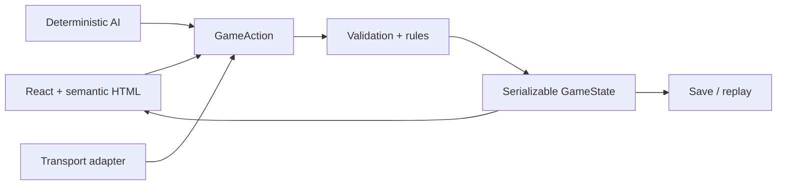

# Architecture

The engine is a DOM-independent TypeScript state machine. `GameState` is explicit JSON-safe data;
each `GameAction` passes through `applyAction`, which clones, validates, resolves, and records the
result. A seeded xorshift generator supports reproducible optional variation.

Content is defined in `src/content` and checked for schema, ID, and graph errors in CI. React owns
menus and accessible controls; SVG/HTML renders the small graph map without making rules depend on
the renderer. Persistence uses versioned JSON and device-local storage; IndexedDB is the planned
multi-slot adapter. AI evaluates public state only and is bounded to prevent loops.

The PWA precaches the static shell with explicit update prompting and outdated-cache cleanup. Vite's
base is `/pax-mediterranea/`. Multiplayer is transport-independent: the optional server/peer layer
carries signed, sequenced commands, while the same authoritative rules validate them. Vitest covers
rules; Playwright covers flows, mobile layouts, PWA-facing behavior, and accessibility.
